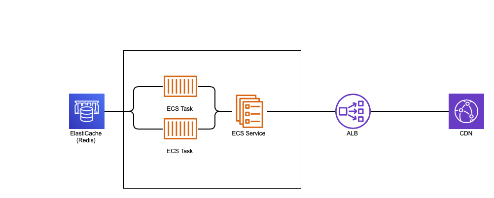

Channel Engine usage guide.

---

Initiate and start the engine.

```javascript
const { ChannelEngine } = require('eyevinn-channel-engine');

const engine = new ChannelEngine(myAssetManager, { channelManager: myChannelManager });
engine.start();
engine.listen(process.env.port || 8000);
```

where `myAssetManager` and `myChannelManager` are classes implementing the [interfaces](adapter-api.md) below.

```javascript
class MyAssetManager {
  async getNextVod({ sessionId, category, playlistId }) -> { id, title, uri, offset, timedMetadata? }
  handleError(err, vodResponse)
}

class MyChannelManager {
  getChannels() -> [ { id, name, slate?, closedCaptions?, profile?, audioTracks?, subtitleTracks?, options? } ]
}
```

In version 3.4.0 or higher Typescript types are also provided:

```javascript
// Typescript
import { 
  ChannelEngine,
  IAssetManager,
  IChannelManager,
  VodRequest,
  VodResponse,
  Channel
} from 'eyevinn-channel-engine';

class MyAssetManager implements IAssetManager {
  async getNextVod(vodRequest: VodRequest): Promise<VodResponse> { ... }
}

class MyChannelManager implements IChannelManager {
  getChannels(): Channel[] { ... }
}

const myAssetManager = new MyAssetManager();
const myChannelManager = new MyChannelManager();

const engine = new ChannelEngine(myAssetManager, { channelManager: myChannelManager });
engine.start();
engine.listen(process.env.port || 8000);
```


## Available Options

Available options when constructing a Channel Engine server object:

- `defaultSlateUri`: URI to an HLS VOD that can be inserted when a VOD for some reason cannot be loaded.
- `slateRepetitions`: Number of times the slate should be repeated. Default is 10.
- `slateDuration`: Duration of the slate. Used to calculate number of repititions needed for reaching desiredDuration. Default is 4000 ms.
- `redisUrl`: A Redis DB URL for storing states that can be shared between nodes.
- `memcachedUrl`: A MemcachedUrl DB URL for storing states that can be shared between nodes.
- `sharedStoreCacheTTL`: How long should data be cached in memory before writing to shared store. Default is 1000 ms.
- `heartbeat`: Path for heartbeat requests
- `channelManager`: A reference to a channel manager object.
- `streamSwitchManager`: A reference to a stream switch manager object.
- `cacheTTL`: Sets the cache-control header TTL. Default is 4 sec.
- `playheadDiffThreshold`: Sets the threshold when starting to adjust tick interval to compensate for playhead drift.
- `maxTickInterval`: The maximum interval for playhead tick interval. Default is 10000 ms. If this value is set. It needs to be longer than the segment length of the media used. If not set Channel engine will automatically adapt.
- `cloudWatchMetrics`: Output CloudWatch JSON metrics on console log. Default is false.
- `useDemuxedAudio`: Enable playing VODs with multiple audio tracks. Default is false.
- `dummySubtitleEndpoint`: Endpoint to dummy subtitle segments, for the case where Channel Engine requires subtitles but source content has none. Default is "/vtt/dummyUrl" (Channel Engine has a default dummy segment handler).
- `subtitleSliceEndpoint`: Endpoint to service which can slice a larger webvtt file into several subset webvtt files. Default is "/vtt/sliceUrl" (Channel Engine has a default Slicer).
- `useVTTSubtitles`: Enable playing VODs with subtitles. Default is false.
- `alwaysNewSegments`: Force all new HLS media sequences to always contain at least 1 new segment. Default is false.
- `alwaysMapBandwidthByNearest`: When loading the next VOD in playlist, force mapping bandwidths between previous and next by nearest bandwidth value.
- `diffCompensationRate`: The rate for how much time is added on each sequence to slow down the playhead until it is back on schedule. Default is 0.5 (delay with half a segment duration).
- `staticDirectory`: Name of static directory for restify server on "/" path. Default is "index.html".
- `averageSegmentDuration`: Estimated average segment duration. Default is 3000 ms. (soon deprecated)
- `targetDurationPadding`: Padding to add to the hls manifest's "#EXT-X-TARGET-DURATION:" value. When not set, will use a targetduration equal to the segment with the longest duration in the entire VOD.
- `forceTargetDuration`: Locks the hls manifest's "#EXT-X-TARGET-DURATION:" to a specified value.
- `noSessionDataTags`: Disables including Channel Engine "#EXT-X-SESSION-DATA" tags in Multivariant manifest.
- `volatileKeyTTL`: TTL for the volatileKey, used for High-Availability mode. To keep check if a Channel Engine instance is alive. Default is 5 sec.
- `autoCreateSession`: Enable automatic creation of a channel/session through the 'channel' query parameter. 

## Master manifest filtering

The engine supports a very simplistic and basic filtering of media playlists included in the master manifest. Currently supports to filter on video bandwidth and video height. To specify a filter provide the query parameter `filter` when loading the master manifest, e.g. `(type=="video"ANDheight>200)AND(type=="video"ANDheight<400)`. This needs to be URL encoded resulting in the following URL: `http://localhost:8000/channels/1/master.m3u8?filter=%28type%3D%3D%22video%22ANDheight%3E200%29AND%28type%3D%3D%22video%22ANDheight%3C400%29`.

To filter by video bandwidth use the `systemBitrate` keyword in the query, e.g. `(type=="video"ANDsystemBitrate>2121000)AND(type=="video"ANDsystemBitrate<6161000)`.

You can also combine the filter conditions, e.g. `(type=="video"ANDheight>240)AND(type=="video"ANDsystemBitrate<4141000)`

## Enabling Demuxed Audio

To support playing assets with multiple audio tracks, a list of supported languages needs to be pre-defined.
Assign to the `audioTracks` property,
in the return object for the channel manager class's `getChannels()` function, a list of objects in the following format

```js
{
  language: { type: string } ,
  name:  { type: string },
  default: { type: bool } // optional
}
```
Example value for `audioTracks`:
```js
audioTracks = [ { language: "en", name: "English", default: true }, { language: "es", name: "Español" } ];
```
**NOTE:** In the case where an asset does not have a track in a language found in the pre-defined list, then the asset's default track will be played in its place.

Find a simplistic reference implementation for guidance about using demuxed VODs in `./server-demux.js`.

## Enabling Subtitles

To support playing assets with subtitles, a list of all expected languages needs to be pre-defined.
Assign to the `subtitleTracks` property,
in the return object for the channel manager class's `getChannels()` function, a list of objects in the following format

```js
{
  language: { type: string } ,
  name:  { type: string },
  default: { type: bool } // optional
}
```
Example value for `subtitleTracks`:
```js
subtitleTracks = [ { language: "en", name: "English", default: true }, { language: "es", name: "Español" } ];
```

**NOTE:** In the case where an asset does not have a track in a language found in the pre-defined list or subtitles at all,
channel engine will return a list of segments with links to an endpoint returning empty WebVTT files.

There are some extra options that can be set in regards to subtitles:
- `dummySubtitleEndpoint`: An endpoint to where it will return empty WebVtt files. By default this is an endpoint inside channel engine.
- `subtitleSliceEndpoint`: An endpoint that will handle slicing up larger WebVTT files in to smaller files that has the same duration as the video segments. By default this is an endpoint inside channel engine.

If you choose to change these any of these options the endpoints needs to be able to return proper WebVtt files

Find a simplistic reference implementation for guidance about using subtitled VODs in `./server-demux.js`.

## Enabling Closed-Captions

To support playing assets with in-stream closed-captions, a list of supported languages needs to be pre-defined.
Assign to the `closedCaptions` property,
in the return object for the channel manager class's `getChannels()` function, a list of objects in the following format

```js
{
  lang: { type: string } ,
  name:  { type: string },
  default: { type: bool } // optional, defaults to false
  auto: { type: bool } // optional, defaults to false
  id: { type: string } // The HLS INSTREAM-ID
}
```
Example value for `closedCaptions`:
```js
closedCaptions = [ { lang: "eng", name: "english", auto: true, default: true, id: "CC1" } ];
```

## Channel Profile with Advanced Audio

*Available from v4.x*

To configure the channel profile to support advanced audio codecs such as Dolby Atmos you specify this in the `profile` property returned by the channel manager class's `getChannels()` function.

```js
[{
  resolution: { type: number[] }, // array tuple [width, height]
  bw: number, // bandwidth
  codecs: string, // codec string e.g. "avc1.64001F,mp4a.40.2"
  channels: string, // channel layout (default 2 stereo)
}]
```

Example channel profile with support for 1080p, stereo + Dolby Atmos:

```js
      { resolution: [640, 360], bw: 3663471, codecs: "avc1.64001F,mp4a.40.2", channels: "2" },
      { resolution: [1280, 720], bw: 5841380, codecs: "avc1.64001F,mp4a.40.2", channels: "2" },
      { resolution: [1920, 1080], bw: 8973571, codecs: "avc1.64001F,mp4a.40.2", channels: "2" },

      { resolution: [640, 360], bw: 4301519, codecs: "avc1.64001F,ec-3", channels: "16/JOC" },
      { resolution: [1280, 720], bw: 6479428, codecs: "avc1.64001F,ec-3", channels: "16/JOC" },
      { resolution: [1920, 1080], bw: 9611619, codecs: "avc1.640032,ec-3", channels: "16/JOC" },
```

## High Availability

*Available from v3.x*

As the engine is not a stateless microservice accomplish high availablity and redundancy is not a trivial task, and requires a shared cache cluster (also redundant) to store current state.



High availability support is from v3 general available in the Channel Engine and it uses Redis as the shared storage. This allows you to run a replicaset behind a round-robin load balancer as examplified in the drawing above. To enable high-availability initiate the engine with the URL to the Redis cache.

```javascript
const engineOptions = {
  heartbeat: '/',
  averageSegmentDuration: 2000,
  channelManager: refChannelManager,
  defaultSlateUri: "https://maitv-vod.lab.eyevinn.technology/slate-consuo.mp4/master.m3u8",
  slateRepetitions: 10,
  redisUrl: "redis://127.0.0.1",
};

const engine = new ChannelEngine(refAssetManager, engineOptions);
engine.start();
engine.listen(process.env.port || 8000);
```

## Live Mixing

*Available from v3.x*

This feature gives the possibility to mix in a true live stream in a Channel Engine powered linear channel (VOD2Live).

A beta-version of live-mixing with high availability support is available in the Channel Engine. This allows you to use a new component which can let you break in to a scheduled VOD event or Live stream event at any speficied time on top of the usual vod-to-live content.
To enable live-mixing, create a class which implements the following interface.

```javascript
class MyStreamSwitchManager {
  getSchedule(channelId) -> [ { eventId, assetId, title, type, start_time, end_time, uri, duration } ]
}
```
When using **Live Mixing** in **High-Availablilty** mode, it is important to know that the class's  `getSchedule(channelId)` function will be called by each channel-engine instance. Meaning that it is crucial that the implementation of this function will return the same response for each and every channel-engine instance, as they are expecting to be recieving identical lists in order to be synced up for live mixing.

The class's `getSchedule(channelId)` function should return a promise containing the list of events as an object in the following format below:

```javascript
{
  "eventId": {
      "type": "string",
      "description": "Generated ID of the event"
  },
  "assetId": {
    "type": "string",
    "description": "The ID of the asset in the schedule event"
  },
  "title": {
    "type": "string",
    "description": "Title of the asset"
  },
  "type": {
    "type": "number",
    "description": "Type of event (1=LIVE and 2=VOD)"
  },
  "start_time": {
    "type": "number",
    "description": "UTC Start time of the event as a Unix Timestamp (in milliseconds)"
  },
  "end_time": {
    "type": "number",
    "description": "UTC End time of the event as a Unix Timestamp (in milliseconds)"
  },
  "uri": {
    "type": "string",
    "description": "The URI to the VOD asset or Live Stream"
  },
  "duration": {
    "type": "number",
    "description": "The duration of the asset (in milliseconds) NOTE: Not required for Live Stream events"
  }
}
```

Below are examples of a Live stream event and a VOD event respectively:
```javascript
{
  eventId: "eeecd5ce-d2d2-48db-b1b3-233957f7d69e",
  assetId: "live-asset-4",
  title: "My scheduled Live stream event",
  type: 1,
  start_time: 1631003900000,
  end_time: 1631003921000,
  uri: "https://cph-p2p-msl.akamaized.net/hls/live/2000341/test/master.m3u8",
}
```
```
{
  eventId: "26453eea-0ac2-4b89-a87a-73d369920874",
  assetId: "vod-asset-13",
  title: "My scheduled VOD event",
  type: 2,
  start_time: 1631004100000,
  end_time: 1631004121000,
  uri: "https://maitv-vod.lab.eyevinn.technology/VINN.mp4/master.m3u8",
  duration: 2 * 60 * 1000,
}
```
(*Important Note: When it comes to VOD events. Desired `duration` has priority over `end_time`. Meaning that you will only resume VOD2Live content after the asset in the VOD event has finished. This may change in the future.*)

Then create an instance of the class and reference it as the `streamSwitchManager` in your engineOptions, just like you'd do with the channel manager.

```javascript
const MyStreamSwitchManager = new MyStreamSwitchManager();

const engineOptions = {
  heartbeat: '/',
  averageSegmentDuration: 2000,
  channelManager: MyChannelManager,
  defaultSlateUri: "https://maitv-vod.lab.eyevinn.technology/slate-consuo.mp4/master.m3u8",
  slateRepetitions: 10,
  redisUrl: "redis://127.0.0.1",
  streamSwitchManager: MyStreamSwitchManager,
};

const engine = new ChannelEngine(refAssetManager, engineOptions);
engine.start();
engine.listen(process.env.port || 8000);
```

### Stream Switch Manager & The StreamSwitcher
When building a Stream Switch Manager it is good to know the basics of how the **StreamSwitcher** component in Channel Engine works.
Each channel will have it's own **StreamSwitcher** component in the Channel Engine which will continiously, at a set time interval, call the `getSchedule()` function in the StreamSwitchManager to get the list of scheduled events.

*Note: For now, all channels read from the same event schedule*


The **StreamSwitcher** decides whether the channel should show VOD2Live content (chosen by the Asset manager) or true Live content (content specified in the event object).
By default, if no StreamSwitchManager is used, or if the returned schedule list is empty, or if the next event in the schedule list has its `start_time` in the future, the **StreamSwitcher** will have the channel broadcast the VOD2Live feed.


When the **StreamSwitcher** receives a populated schedule list, it will ignore all items whos `end_time` is past the current time, and will only look at the first event whos `end_time` is in the future. When the condition: `event.start_time ≤ (current time) ≤ event.end_time` is true, then the **StreamSwitcher** will perform a switch from VOD2Live to LIVE, where the channel will start broadcasting the true Live stream. When this happens a proper transition between content will take place in the HLS manifests. Also once LIVE, it will not switch again.


VOD2Live content will still be "playing" in the background as fallback content in case the true Live stream has issues or fails.
If the connection to the Live stream ends or if the current time has passed the event `end_time` then the **StreamSwitcher** will switch from LIVE to VOD2Live, having the channel broadcast VOD2Live once again until the next event starts.
